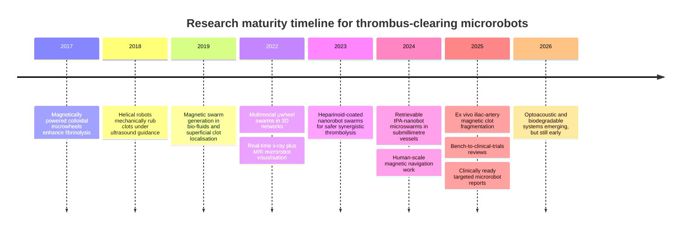
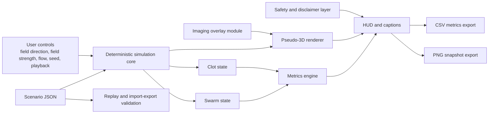

# Knowledge Map and Literature Synthesis for a Pseudo-3D Educational Coronary Microrobot Swarm Simulator

## Executive summary

The scientifically safest and most actionable framing for this project is **not** “nanobots curing heart attacks”, but an **illustrative, non-clinical visualisation inspired by preclinical microrobot and microswarm research**. In real care, acute coronary thrombosis is handled with guideline-based antithrombotic therapy, urgent invasive assessment, and revascularisation—most prominently percutaneous coronary intervention, with thrombolytics used when timely PCI is not available. That makes the simulator’s educational role clear: it should explain *principles of targeted intravascular microrobotic intervention* rather than imply a validated alternative to standard care. citeturn24view0turn24view1turn14view8turn14view9

The strongest research basis for the simulator is a **magnetically guided, field-organised microswarm** that localises to a clot and combines **targeted drug-like action with mechanical contact effects**. The most relevant primary studies include magnetically powered colloidal microwheels that accelerate fibrinolysis through local delivery and corkscrew motion, helical robots that mechanically rub or fragment clots, retrievable tPA-anchored magnetic nanorobot microswarms that work in 0.9–1.5 mm vessels under fluoroscopy, heparinoid-coated magnetic nanorobot swarms engineered for safer thrombolysis in blood, and ex vivo sheep-artery studies that combine magnetic robots with mechanical or hybrid clot removal. This evidence base is preclinical and spans in vitro, ex vivo, and animal models; it is promising, but not clinically established for coronary thrombosis. citeturn17search2turn17search4turn19view0turn15view0turn26search3turn40view0

For simulator design, that literature points to a clear MVP: a **single coronary artery segment**, **one focal clot**, **one external magnetic field control**, and a **swarm of directional microcapsule-like or chevron-like glyphs** that can visibly localise, align, form local spiral or corkscrew clusters, and shrink the clot via **surface erosion plus limited fragment-like events**. The default imaging overlay should look like **x-ray or fluoroscopy**, because that is the most clinically legible and best-supported tracking metaphor in endovascular microrobotics. A coding agent can plausibly build this MVP in a browser-first stack if the equations, data schema, safety copy, scenario boundaries, and acceptance tests are frozen up front; what still needs human judgement is scientific wording, calibration choices, and claim control. citeturn15view0turn28search0turn29search0turn12search0turn12search2

## Clinical context and simulator scope

The immediate clinical backdrop is coronary thrombosis causing myocardial infarction. The entity["organization","European Society of Cardiology","cardiology society eu"] describes acute coronary syndrome management as a continuum centred on diagnosis, antithrombotic therapy, invasive assessment, and revascularisation, while the entity["organization","American Heart Association","cardiology nonprofit us"] and the entity["organization","National Heart, Lung, and Blood Institute","nih institute us"] explain that a heart attack occurs when blood flow in a coronary artery is blocked, with PCI as a central treatment and thrombolytics used when PCI cannot be reached quickly enough. Coronary thrombosis is therefore a compelling educational context, but it is also exactly why the simulator must **not** impersonate treatment planning or procedural guidance. citeturn24view0turn24view1turn14view8turn14view9

The literature also makes an important scope point: although the simulator is set in a **simplified coronary artery segment**, much of the strongest microrobot thrombolysis evidence does **not** yet come from coronary models. Representative studies use microfluidic thrombosis models, rat femoral vessels, rabbit carotid arteries, zebrafish occlusive thrombi, ex vivo human placenta vasculature, and ex vivo sheep iliac arteries. That means coronary use in the simulator should be framed as an **educational transposition of a broader vascular research field**, not as a direct replay of a clinically validated coronary device. citeturn15view0turn17search5turn40view0turn25view0

For visual scale, normal proximal coronary anatomy gives a reasonable anchor. A classic angiographic study reported approximate lumen diameters of **4.5 ± 0.5 mm** for the left main coronary artery, **3.7 ± 0.4 mm** for the proximal LAD, and **1.9 ± 0.4 mm** for the distal LAD. A 2023 observational study of healthy subjects reported resting LAD coronary flow velocity values of roughly **38.6 cm/s** proximally, **34.3 cm/s** in the mid segment, and **28.1 cm/s** distally. Those numbers are useful as qualitative anchors for scene proportions and default flow settings, but the simulator should still use normalised maths rather than patient-level haemodynamics. citeturn30search5turn31view0

A clean way to express scope is to keep the educational view **arterial-only**, make the segment **LAD-like**, and add only a small **heart or body context inset** so viewers understand where the vessel sits in the circulation. That gives enough recognisability for judges and non-specialists while avoiding a sprawling anatomical model that would imply clinical precision the evidence does not yet support. citeturn14view9turn30search5turn31view0

| Scope choice | Why it is justified | Design implication |
|---|---|---|
| Single coronary artery segment | Coronary thrombosis is central to heart attack education, but microrobot evidence is still preclinical and mostly non-coronary. citeturn14view9turn25view0turn15view0 | Use one straight-to-mildly-curved LAD-like segment, not full coronary tree simulation. |
| One clot at a time | Most thrombolysis studies focus on one target occlusion and one delivery episode. citeturn15view0turn19view0turn40view0 | One focal clot is scientifically grounded and visually legible. |
| Non-clinical outputs only | Standard care is real and established; simulator outputs must not compete with it. citeturn24view0turn24view1turn14view8 | Replace “restored flow %” with an educational index. |
| No patient-specific anatomy or prediction | Current research does not justify bedside predictive claims in coronary use. citeturn25view0turn35search15turn35search4 | Use presets, seeds, and scenario files, not patient data. |

## Microrobot thrombolysis landscape

A key naming issue should be frozen early. Public audiences say “nanobots”, but the literature spans **micro/nanorobots**, **microwheels**, **helical microrobots**, **magnetic bead assemblies**, and **drug-carrying microcapsules**. Many of the most experimentally mature platforms are not autonomous nanomachines at all; they are externally actuated particles or microscale bodies whose collective behaviour emerges under magnetic or acoustic fields. The simulator’s safest public language is therefore **“microrobot-inspired swarm”** or **“nanobot-like educational swarm”**, with tooltips that explain the inspiration comes from preclinical micro/nanorobotics research. citeturn25view0turn15view0turn18view2turn19view0

The table below maps the leading geometry families to simulator implications.

| Geometry family | What the literature shows | Strengths for this project | Limits | Best simulator metaphor |
|---|---|---|---|---|
| **Colloidal beads and µwheels** | Superparamagnetic **4.5 µm** beads assemble into µwheels under weak rotating fields of about **4 mT**, can exceed **200 µm/s**, and in swarm form can target through 3D branched networks over centimetre scales. Earlier work showed enhanced fibrinolysis and later work showed co-delivery of tPA and plasminogen with corkscrew-style contact. citeturn18view2turn17search2turn17search4 | Strongest “swarm” look, good for collective clustering, rolling, spreading, and local drilling. | Individual agents are tiny and would not be literally visible in a human-facing visualisation. | **Primary inspiration** for a coordinated clot-seeking swarm. |
| **tPA-anchored magnetic nanorobot microswarms** | Wang et al. reported retrievable magnetic colloidal microswarms built from **~300 nm** tPA-anchored nanorobots, guided under x-ray fluoroscopy with catheter assistance, with demonstrations in **1.5 mm** placenta vessels and a **0.9 mm** rabbit carotid artery; the mechanism combined chemical etching and mechanical interaction. citeturn15view0turn16view2turn16view3turn16view4 | Excellent match for “external field + swarm + clot lysis + retrieval”. | Real system depends on catheter delivery and specialised actuation/imaging. | **Secondary inspiration** for clot-zone behaviour and imaging overlay. |
| **Heparinoid-coated magnetic nanorobot swarms** | A 2023 Science Advances study reported HPB-coated magnetic nanorobots that avoid agglomeration in blood-like conditions, reduce haemolysis and bioadhesion, self-anticoagulate, and perform synergistic thrombolysis via motile targeting plus mechanical destruction. citeturn26search3 | Strong rationale for safer-looking, blood-compatible swarm behaviour. | Hard to visualise literally; chemistry is too deep for MVP. | Useful for **safety wording** and “cohesive but non-sticky” swarm motion. |
| **Helical swimmers and untethered magnetic robots** | Helical robots have been used for clot rubbing and clot clearing with ultrasound or magnetic localisation; a 2018 study reported clot removal rates around **0.48–0.61 mm³/min** at **35 Hz**, and 2025 ex vivo work in sheep iliac arteries reported mechanical or hybrid fragmentation using untethered magnetic robots. citeturn19view0turn40view0turn38search21 | Strong, intuitive sense of “active drilling” and directed contact. | Usually one or a few agents rather than a dense swarm. | Best used as a **local coordination mode**, not the whole swarm’s default shape. |
| **Clinically oriented magnetic microcapsules** | 2025 reports around clinically ready magnetic microrobots describe rtPA-loaded, imaging-visible, dissolvable magnetic microcapsules navigated in human vasculature models and large-animal conditions. citeturn8search0turn9search15turn9search19 | Closest thing to a near-clinic storyline. | Much less “swarm-intelligent” in appearance than µwheels. | Good inspiration for **agent art direction**: tiny capsules or chevrons rather than cartoon robots. |

Clot disruption in the literature is not one thing. It is a family of mechanisms that can be rendered differently depending on the educational emphasis. The safest and most evidence-aligned visual combination for this project is **targeted chemical erosion as the dominant effect**, **local corkscrew or rubbing bursts as intermittent secondary effects**, and **small, fading local fragments or debris sprites** rather than explosive chunks. Large projectile fragments look dramatic, but they would misrepresent the field and create avoidable safety confusion. citeturn17search2turn17search4turn15view0turn19view0turn40view0

| Disruption mechanism | Representative evidence | What it means visually | Recommendation for MVP |
|---|---|---|---|
| **Localised chemical lysis** | µwheel and nanorobot studies repeatedly use tPA or related lytic payloads to increase clot breakdown at the target. citeturn17search2turn17search4turn15view0 | Edges soften, clot opacity drops, clot volume shrinks over time. | **Yes**. Make this the baseline behaviour. |
| **Contact-enhanced surface erosion** | Wang et al. explicitly describe combined chemical etching and mechanical interaction; µwheel studies emphasise local contact and corkscrew motion. citeturn15view0turn17search2turn17search4 | Swarm sits on the clot boundary and “wears away” the front face. | **Yes**. This should be the main visible action. |
| **Penetration or microchannel boring** | Corkscrew motion has been used to exceed diffusion-limited fibrinolysis and UMR/helical systems use direct contact for clot penetration or boring. citeturn17search4turn19view0turn38search0 | Small borehole or spiral tunnel appears in the clot centre. | **Yes, sparingly**. Use as a timed coordination event. |
| **Mechanical rubbing and fragmentation** | Helical rubbing and untethered magnetic robot fragmentation are supported in vitro, ex vivo, and hybrid studies. citeturn19view0turn40view0 | Larger flakes or granules detach. | **Partial**. Keep fragments local, sparse, and quickly cleared. |
| **Hybrid mechanical plus chemical dissolution** | 2025 ex vivo iliac-artery work shows hybrid approaches can outperform chemical lysis alone. citeturn40view0 | Surface erosion accelerates during contact bursts. | **Yes**. Best scientific fit for the simulator. |
| **Photothermal or photodynamic multimodal lysis** | Recent studies combine magnetic control with photothermal or photodynamic effects, but these remain more specialised and less intuitive for a coronary educational MVP. citeturn3search2turn3search15 | Heat-glow or light effects. | **No for MVP**. Reserve for an advanced scenario pack. |

## Actuation, coordination, imaging, and experimental evidence

Magnetic actuation is the best-supported foundation for this simulator. Reviews and primary papers consistently describe magnetic fields as especially suitable for biomedical microrobots because they are **contactless**, **remotely controllable**, and penetrate tissue well enough to support intravascular navigation. Primary thrombolysis papers using microswarms, µwheels, helical robots, and retrievable drug-carrying microrobots overwhelmingly adopt magnetic control. For this reason, if the MVP exposes only one “external field” control family, it should be magnetic. citeturn23search3turn41search5turn15view0turn18view2

Acoustic microrobotics deserves coverage, but mainly as a comparator and a future extension. Ultrasound-driven or acoustically assembled systems can offer strong tissue penetration and useful propulsion; a 2023 study reported self-assembled microrobots capable of upstream motion in brain vasculature, albeit at very low robot speeds relative to the surrounding flow, and hybrid magneto-acoustic reviews now explicitly present magnetic steering plus acoustic propulsion as a way to balance control and thrust. That said, the thrombolysis literature most directly usable for a coronary educational simulator still leans magnetic, not acoustic. citeturn11search2turn23search22turn23search25

| Actuation family | Research status | Main advantages | Main limitations | Simulator implication |
|---|---|---|---|---|
| **Magnetic** | Dominant in thrombolysis microrobotics and vascular navigation. citeturn15view0turn18view2turn41search5 | Contactless control, flexible steering, tissue penetration, clinically familiar imaging pairings. | Requires specialised magnetic hardware; thrust can be limited in strong flow. | **Default MVP control model.** |
| **Acoustic** | Active but less dominant for clot work; promising for propulsion and upstream motion. citeturn11search2turn23search22 | Good tissue penetration, useful propulsion, non-ionising. | Directional control in complex anatomy is harder. | Good **future research mode**, not default. |
| **Hybrid magnetic plus acoustic** | Emerging and increasingly reviewed as a way to combine steering with propulsion. citeturn23search15turn23search22 | Better division of labour between navigation and movement. | More complex to explain and implement. | Keep as **Phase 2** extension. |

The coordination model in the simulator should follow the literature rather than science fiction. In actual microrobot swarms, the most grounded mechanisms are **global field-driven alignment**, **field-induced self-assembly**, **medium-induced clustering**, and **pattern reconfiguration under common actuation inputs**. This is very different from the popular image of fully autonomous agents talking to one another. In other words, the simulator should make the swarm look coordinated because the **field organises it**, not because each tiny agent is independently planning. A small amount of boids-style micro-jitter can be layered in purely to make motion feel natural, but the top-level logic should be global-field control plus local cohesion. Reynolds’s boids model is useful as an animation primitive; it is not the primary biomedical control model here. citeturn25view3turn23search8turn33search0turn33search5

If a later version wants more explicit “swarm intelligence”, the most research-aligned path is not leader–follower, but **state-dependent mode switching** between translational advance, clot-zone clustering, local corkscrew penetration, and dispersion or retrieval. That pattern is much closer to the actual field of microrobot swarm control than a visible “leader” agent pulling the group around. Leader–follower can still be useful internally for debugging or for a future autonomy module, but it should not define the outward scientific story of the MVP. citeturn23search8turn10search1turn33search2

Imaging is equally important because the chosen overlay strongly shapes audience expectations. The highest-value evidence for this simulator points to **fluoroscopy or x-ray** as the default educational overlay, especially because recent thrombolysis and vascular navigation papers explicitly use catheter-assisted fluoroscopy, clinical C-arm systems, or x-ray-guided manipulation. Ultrasound and photoacoustic imaging are valuable secondary overlays for a “research view”, while MRI and MPI are best treated as advanced or optional overlays rather than the default. citeturn15view0turn28search0turn21view2turn29search0

| Imaging modality | What the literature supports | Trade-off | Best use in simulator |
|---|---|---|---|
| **X-ray and fluoroscopy** | 2024 work used clinical C-arm cinefluoroscopy at **15 fps** and DS at **8 fps**; 2024 tPA-nbot thrombolysis also used fluoroscopy-guided delivery and retrieval. citeturn28search0turn15view0 | Realistic endovascular feel, but low anatomical softness and ionising-radiation associations. | **Default overlay.** |
| **Ultrasound** | Helical clot rubbing used ultrasound feedback; ultrasound-based microrobot detection and tracking are active areas. citeturn19view0turn28search9 | Non-ionising and familiar, but small-object contrast can be poor. | Good **secondary overlay**. |
| **Ultrasound plus photoacoustic** | US+PA tracking detected microrobots down to **50 µm** and through **25 mm** of tissue mimic, with strong small-object contrast. citeturn21view2 | Scientifically exciting, but more research-lab than cath-lab. | Great for **advanced research mode**. |
| **MRI or MPI** | MRI and x-ray visualisation have been combined in vivo in tumour-vessel microrobots; MPI has enabled accurate localisation in vascular phantoms. citeturn29search0turn41search8 | Deep imaging, but system complexity is high and visual language is less intuitive to general audiences. | Optional **alternate overlay** only. |
| **Optical** | Optical and all-optic tracking can be excellent in transparent or accessible settings, but line-of-sight is a core limitation in vivo. citeturn21view2turn29search15 | Great clarity, poor realism for intravascular clinical settings. | Use only in **developer or lab debug view**. |

A good way to summarise the maturity of the field is by the progression from microfluidic and surface models, to ex vivo branching vessels, to small-animal and selected large-animal navigation systems, and then to 2025 work explicitly framed as “clinically ready” targeted microrobots. The timeline below is the right mental model for the simulator’s storytelling: **established in preclinical principle, promising in translational engineering, still speculative for routine coronary practice**. citeturn17search2turn19view0turn25view3turn18view2turn29search0turn15view0turn40view0turn8search0turn9search15

The practical takeaway from that timeline is that your simulator should visually signal **cutting-edge research demonstrator**, not **finished clinical device**. That distinction is the difference between an impressive, credible explainer and a misleading one. citeturn25view0turn35search15turn35search4

## Translation barriers and claim-safe framing

The main translational bottlenecks are now quite consistent across the literature. They include **biocompatibility**, **biodegradability or reliable retrieval**, **haemolysis and thrombogenicity control**, **imaging visibility**, **field generation at clinically useful scales**, **manufacturing reproducibility**, and **robust navigation in real flowing, branching, deforming vessels**. Even highly promising studies still discuss removal after use, non-toxic materials, imaging, and system integration as open problems rather than solved ones. citeturn25view0turn35search4turn9search15turn35search20turn35search21

Clot fragmentation itself is a framing hazard. Some studies intentionally use mechanical fragmentation or hybrid fragmentation, but that does not mean an educational simulator should foreground big flying embolic pieces. For a public-facing science explainer, the safest solution is to show **tiny, local, non-ballistic debris effects** that remain visually subordinate to erosion and channel opening, while tooltips make clear that the visual is illustrative and not a literal risk model of embolisation. citeturn40view0turn19view0turn17search4

From a software-regulatory standpoint, intended use language is decisive. The entity["organization","Food and Drug Administration","us regulator"] states that software intended for diagnosis, cure, mitigation, treatment, or prevention of disease may meet the definition of a device, and the entity["organization","Medicines and Healthcare products Regulatory Agency","uk regulator"] likewise emphasises that intended purpose statements must clearly specify what product does, for whom, and in what setting. That means the simulator must avoid any wording that implies diagnosis, procedural recommendation, treatment optimisation, or patient-specific prediction. citeturn24view2turn24view3

Recommended public disclaimer language is therefore:

> **This simulator is an educational visualisation inspired by preclinical microrobot research. It is not a medical device and must not be used for diagnosis, treatment planning, patient risk estimation, or procedural guidance. All motion, metrics, and scores are simplified, non-patient-specific, and intended only to illustrate scientific concepts.**

That wording stays aligned with intended-use guidance while still letting the project sound ambitious and technically serious. citeturn24view2turn24view3

Accessibility is not optional here because the product contains continuous motion, colour-coded state, and a dense control panel. The entity["organization","World Wide Web Consortium","web standards body"] WCAG 2.2 guidance is directly relevant: moving content must be pausable or stoppable, minimum target size should be at least **24 × 24 CSS pixels**, normal text should meet **4.5:1** contrast, meaningful non-text graphics should meet **3:1** contrast, and motion-heavy content should have text alternatives or captions. In practice, that means always-visible pause and step controls, keyboard navigability, text-only captions for every simulation phase, and HUD graphics that never rely on colour alone. citeturn14view14turn6search1turn6search2turn6search3turn13search1turn13search5

## Simulator design implications

The diagram below shows the right conceptual architecture for the simulator: a deterministic core fed by scenario inputs and user controls, with agent state, clot state, metrics, rendering, imaging overlays, export, and a persistent safety layer. This decomposition is directly supported by the research literature, which treats navigation, payload interaction, imaging, and feedback as distinct but tightly coupled subsystems, and it also matches the capabilities of a browser-first stack built on Three.js instancing and later packaged with Tauri. citeturn15view0turn28search0turn29search0turn12search0turn12search2

The recommended parameter set should remain normalised, but it should be anchored to plausible literature ranges so the simulator “feels” grounded.

| Simulator parameter | Literature anchor | Recommended user-facing range | Design note |
|---|---|---|---|
| **Vessel diameter preset** | Proximal LAD about **3.7 mm**, distal LAD about **1.9 mm**. citeturn30search5 | 0.8–1.2 normalised vessel-size scalar around a 3 mm reference | Keeps the artery recognisably coronary without pretending to model a patient artery. |
| **Flow speed** | Resting LAD CFV roughly **28–39 cm/s** across distal-to-proximal segments in healthy subjects; microrobot studies also show strong performance dependence on flow. citeturn31view0turn16view5 | 0.4–1.4 normalised | Use steady or gently pulsed flow for MVP; true coronary pulsatility can wait. |
| **Visible agent count** | Physical platforms range from submicron particles to micron beads and clustered swarms, so literal one-to-one rendering would be unreadable. citeturn16view4turn18view2 | **150–600 visible glyphs** | Each glyph should represent an aggregate, not a literal single device. |
| **Field strength** | µwheel work uses weak fields around **4 mT**; Wang et al. used **64.9 mT** in a rat model. citeturn18view2turn16view0 | 0–1 normalised, optionally annotated as “low to high” | If you later map to pseudo-physical units, use a literature-inspired **4–65 mT equivalent** scale. |
| **Clot burden** | Primary studies consistently monitor clot shrinkage, perfusion, recanalisation time, or change rate rather than patient-specific risk. citeturn15view0turn40view0 | 0–100% | This should be the primary scientific metric. |
| **Localisation radius** | Studies target clot proximity and field-guided contact; localisation matters because local concentration is the point. citeturn15view0turn17search4 | 0.2–0.35 vessel diameters around the clot face | Tight enough to reward precise field control. |
| **Corkscrew mode intensity** | Corkscrew or spiral contact is one of the best-supported secondary mechanisms. citeturn17search2turn17search4turn19view0 | 0–1 mode scalar | Activate only when swarm is already localised. |
| **Clot size or occlusion fraction** | Experimental vessel occlusions span submillimetre to millimetre-scale targets; exact coronary clot geometry is not yet well constrained by microrobot papers. citeturn15view0turn40view0 | 0.3–0.9 initial occlusion fraction | Treat as illustrative and scenario-based, not physiological truth. |

A minimal but well-grounded metric system can be built from four equations.

The first is **localisation**, which should be literal and easy to explain:

\[
L_t=\frac{N_{\text{agents in clot zone}}}{N_{\text{active agents}}}
\]

This directly measures whether the externally guided swarm is actually concentrating where it matters. That is the central promise in the microrobot thrombolysis literature: *local action at the clot rather than diffuse systemic action*. citeturn15view0turn17search4turn26search3

The second is **coordination quality**, which can be modelled as a blend of heading alignment and compactness:

\[
C_t=\mathrm{clamp}\left(0.5\left\lVert \frac{1}{N}\sum_i \hat{v}_i \right\rVert + 0.5\left(1-\frac{\sigma_r}{r_c}\right),0,1\right)
\]

Here, the first term rewards shared direction while the second rewards a tighter clot-facing cluster. That is a good compromise between the real literature on field-driven self-assembly and the practical need for natural-looking motion in a science visualisation. citeturn25view3turn18view2turn33search0

The third is the **clot-burden update**, where chemical erosion and penetration-like contact are separate but additive:

\[
B_{t+\Delta t}=\mathrm{clamp}\Big(B_t-\Delta t\,[k_e\,L_t\,S_t\,F_t\,(1-U_t)+k_p\,L_t\,C_t\,F_t\,P_t],0,1\Big)
\]

In this formulation, \(B\) is the remaining clot burden, \(S\) is local swarm density, \(F\) is field effectiveness, \(U\) is flow opposition, and \(P\) is penetration mode. The first term gives you steady surface erosion from localisation and local concentration; the second gives you intermittent acceleration when the swarm is both compact and corkscrew-like. This is a clean abstraction of what the literature actually shows: **targeted lysis is stronger when particles are near the clot, actively contacting it, and mechanically organised**. citeturn17search2turn17search4turn15view0turn19view0turn40view0

The fourth is the replacement for “restored flow %”. The safest educational metric is **Simulated Vessel Patency Index**:

\[
SVPI_t=100\times(1-O_t)^\gamma
\]

where \(O_t\) is residual occlusion and \(\gamma\) is a shaping exponent. A default of **\(\gamma=2.5\)** gives a pleasing non-linear sense that vessel opening matters more as the channel becomes genuinely patent. If you want a more explicitly haemodynamic “theme”, you can expose an advanced mode with **\(\gamma=4\)** because flow resistance in simplified narrowed-vessel models is strongly sensitive to lumen radius, but that setting should be labelled as a **visualisation style**, not a physiological measurement. citeturn34search4turn34search0

This is exactly why the metric should be called **Simulated Vessel Patency Index** rather than “restored flow %”. The wording signals educational intent and avoids implying that the simulator is calculating true coronary perfusion. A good tooltip is:

| Metric | Tooltip text |
|---|---|
| **Clot Burden** | “Estimated fraction of the simulated clot still present.” |
| **Simulated Vessel Patency Index** | “Educational index of how open the simulated vessel appears. Not a measured blood-flow value.” |
| **Swarm Localisation** | “Share of visible agents currently concentrated at the clot.” |
| **Elapsed Time** | “Simulation time since the swarm was introduced.” |
| **Field Strength** | “Relative strength of the external guidance field in this model.” |

The visual language should deliberately separate **clean educational view** from **imaging overlay view**. In the clean view, use **small triangular or chevron-like agents** with very short tails or heading cues. Circles are scientifically plausible for beads, but they do not communicate direction or coordinated alignment as clearly; full helical screws communicate motion well, but if every agent is a visible screw the swarm starts to look less like the bead or microcapsule systems that dominate the translational literature. A hybrid symbol—small directional microcapsule or chevron—best fits the evidence and the visual task. In the imaging overlay, collapse those same agents into **bright dots or a bright swarm cloud**, because actual x-ray guidance would not show cartoon robot bodies. citeturn18view2turn15view0turn19view0turn8search0turn29search0

The clot itself should pass through visible phases. Early on, it is compact and high-contrast. During localisation, its face should brighten and pit slightly. During corkscrew or penetration bursts, a faint spiral or local vortex should appear at the contact point. During progression, the clot silhouette should shorten or hollow, the patent channel should widen, and the SVPI should rise. Small debris should remain near the clot and fade quickly so the rendering communicates “local breakdown” rather than “dangerous projectile fragmentation”. Text-only captions should narrate these phases explicitly: *Swarm localising*, *Field-aligned clustering*, *Surface erosion increasing*, *Microchannel opening*, *Patency rising*. citeturn17search4turn15view0turn40view0

## Ready for SRS and Codex implementation

If the SRS freezes the educational scope, parameter schema, equation set, visual metaphors, and claim-safe wording above, then an AI coding agent can likely implement the MVP effectively. The reason is straightforward: the engineering problem is a bounded **TypeScript plus Three.js deterministic simulation and UI problem**, not an open-ended biomedical inference problem. The work below is the right breakdown. citeturn12search0turn12search1turn12search2turn24view2turn24view3

1. **Scenario schema and deterministic core**  
   Build a strongly typed scenario schema for vessel preset, clot parameters, flow speed, swarm size, concentration factor, field strength, field direction, playback speed, and seed. Implement the normalised state update loop and guarantee that the same seed and same inputs produce the same replay every time.  
   **Required assets:** JSON schema, TypeScript interfaces, deterministic PRNG, baseline scenario fixtures.  
   **Core tests:** identical replay hash for repeated seed runs; schema round-trip tests for import and export.  
   **Acceptance criteria:** a scenario exported to JSON and re-imported reproduces the same clot-burden and SVPI curves frame-for-frame for a fixed number of steps.

2. **Pseudo-3D vessel scene and renderer**  
   Build a browser-first vessel segment scene with at least one LAD-like artery preset, one clot object, and four camera modes: overview, swarm follow, clot close-up, and imaging overlay. Use Three.js instancing for agents so draw calls remain low as visible swarm count increases.  
   **Required assets:** vessel material set, clot material or shader, agent mesh or glyph, camera presets.  
   **Core tests:** camera switching, scene load and resize tests, target performance tests.  
   **Acceptance criteria:** **60 fps target and 30 fps minimum** with the default scenario on the target desktop class; visible-agent rendering uses instanced meshes rather than one mesh per agent. citeturn12search0turn12search1

3. **Swarm control and motion layer**  
   Implement global field steering, local alignment, localisation attraction, clot-zone corkscrew mode, and retrieval or dispersion mode. Keep boids-like noise minimal and subordinate to field-driven control.  
   **Required assets:** state machine definition, motion constants, seedable random noise layer.  
   **Core tests:** field-direction change visibly rotates swarm heading; localisation rises when the swarm enters the clot zone; corkscrew mode activates only in the correct state.  
   **Acceptance criteria:** under the same scenario, increasing field strength or concentration factor increases localisation and reduces clot burden monotonically relative to baseline.

4. **Clot breakdown and metrics engine**  
   Implement clot erosion, optional localised fragment events, SVPI, clot burden, localisation, and elapsed time. Fragments must be a visual effect, not an independent embolic simulator.  
   **Required assets:** metric definitions, CSV export formatter, chart configuration.  
   **Core tests:** burden never goes below zero; SVPI never exceeds 100; CSV exports are deterministic and machine-readable.  
   **Acceptance criteria:** the metrics HUD updates in real time; CSV export contains timestamped values for all required metrics; burden and SVPI are mathematically consistent with the stored state.

5. **Advanced lab-style control panel and guided captions**  
   Surface all controls at once in a text-first interface, with explicit labels, live numeric values, reset, pause, step, speed, camera, and mode toggles. Add caption text that narrates each simulation phase in plain English.  
   **Required assets:** copy deck, labels, tooltip strings, keyboard map, caption script.  
   **Core tests:** keyboard-only traversal, focus visibility, pause and step accessibility, caption update tests.  
   **Acceptance criteria:** controls meet WCAG-aware target sizing and contrast rules; moving animation can always be paused or stepped; every major phase has a text caption. citeturn14view14turn6search1turn6search2turn6search3

6. **Exports, snapshots, and replay**  
   Provide JSON scenario import or export, CSV metrics export, and PNG snapshot export from the current camera.  
   **Required assets:** export utilities, filename schema, snapshot capture service.  
   **Core tests:** file validity, successful re-import, snapshot fidelity.  
   **Acceptance criteria:** all three export types succeed from browser mode without losing deterministic replay behaviour.

7. **Safety layer and packaging path**  
   Keep disclaimer text always accessible, ensure tooltips avoid diagnostic wording, and package later with Tauri using a least-privilege capability setup.  
   **Required assets:** disclaimer copy, intended-use test checklist, Tauri capability manifest.  
   **Core tests:** UI copy linting for banned phrases such as diagnosis or treatment recommendation; desktop packaging smoke tests.  
   **Acceptance criteria:** no user-facing text implies diagnosis, treatment, prevention, or patient-specific prediction; Tauri build packages successfully with explicit window and permission capabilities rather than broad defaults. citeturn24view2turn24view3turn12search2turn12search17

A useful milestone sequence is therefore: **M1 foundation and replay**, **M2 vessel plus swarm renderer**, **M3 clot-breaking metrics and guided story**, **M4 exports and Tauri packaging**. That order is appropriate for a coding agent because it front-loads deterministic correctness before visual polish. citeturn12search0turn12search2

## Prioritized bibliography and remaining gaps

The sources below are the most important ones to anchor into the formal SRS, architecture notes, and implementation prompts.

1. **ESC 2023 guidelines for acute coronary syndromes** — best high-level source for the real clinical pathway that your simulator must *not* replace. citeturn24view0  
2. **AHA and NHLBI heart attack treatment material** — clear public-facing sources on PCI, clot-busting drugs, and coronary blockage framing. citeturn24view1turn14view8turn14view9  
3. **Wang et al., 2024, Science Advances: tPA-anchored nanorobots for in vivo arterial recanalisation** — probably the single most important primary paper for your simulator concept, because it combines magnetic guidance, fluoroscopy, submillimetre vessels, clot lysis, and retrieval. citeturn15view0turn16view2turn16view4  
4. **Tasci et al., 2017, Small: enhanced fibrinolysis with magnetically powered colloidal microwheels** — foundational for the swarm-plus-corkscrew visual metaphor. citeturn17search2  
5. **Disharoon et al., 2022, Journal of Thrombosis and Haemostasis: breaking the fibrinolytic speed limit** — crucial for the idea that local delivery plus corkscrew interaction beats passive diffusion. citeturn17search0turn17search4  
6. **Zimmermann et al., 2022, Scientific Reports: multimodal µwheel swarms in 3D networks** — best source for how a swarm can translate, climb, spread, and target through branched vascular-like networks. citeturn18view2  
7. **Khalil et al., 2018, IEEE RA-L: mechanical rubbing of blood clots using helical robots** — strongest direct source for the “mechanical contact” mode. citeturn19view0  
8. **Khalil et al., 2019, APL Bioengineering: helical robots for clearing superficial blood clots** — useful for localisation and closed-loop guidance concepts even though it is not a dense swarm study. citeturn20search4turn38search21  
9. **Yang et al., 2023, Science Advances: heparinoid-polymer-brush magnetic nanorobots** — important for safety and blood-compatibility framing. citeturn26search3  
10. **de Boer et al., 2025, Applied Physics Reviews: wireless mechanical and hybrid thrombus fragmentation in ex vivo sheep iliac artery** — strongest recent source for ex vivo mechanical and hybrid removal with x-ray-guided untethered robots. citeturn40view0  
11. **Alabay et al., 2024, Frontiers in Robotics and AI: x-ray fluoroscopy-guided localisation and steering** — best support for using a fluoroscopy-like imaging overlay and a digital-twin style navigation metaphor. citeturn28search0turn28search7  
12. **Go et al., 2022, Science Advances: multifunctional microrobot with real-time x-ray and MRI visualisation** — important for the imaging comparison table and for positioning MRI as an advanced overlay rather than the default one. citeturn29search0turn29search8  
13. **Wang et al., 2025, The Innovation: bench-to-clinical-trials review** — best synthesis of where thrombus-treatment microrobots stand overall, including myocardial infarction as a target condition. citeturn25view0  
14. **Iacovacci et al., 2024, Annual Review of Biomedical Engineering: medical microrobots** — valuable broader translational context on actuation, imaging, and barriers. citeturn23search20turn35search19  
15. **W3C WCAG 2.2 documentation** — essential for control-panel design, captions, contrast, motion control, and keyboard accessibility. citeturn14view14turn6search1turn6search2turn6search3  
16. **FDA and MHRA intended-use guidance** — non-negotiable references for disclaimer language and claim safety. citeturn24view2turn24view3  

The main gaps that still require lab-specific or product-specific decisions before implementation are also relatively clear.

1. **Coronary-specific microrobot data are sparse.** Much of the best thrombolysis work is non-coronary, so coronary motion, geometry, and cardiac-motion effects remain an extrapolation for educational purposes. citeturn25view0turn15view0  
2. **True fragment behaviour is not mature enough for a public simulator.** If you want a more realistic fragmentation mode later, you would need explicit embolisation-risk assumptions and probably clinical review. citeturn40view0turn35search15  
3. **Field-to-hardware mapping is still ambiguous.** A user slider for “field strength” can be literature-grounded, but a faithful mapping to a specific coil system or clinical room geometry would require hardware data not present in a generic educational product. citeturn15view0turn41search0turn9search15  
4. **Clot composition is underspecified.** Fibrin-rich, platelet-rich, and mixed thrombi would behave differently, and most educational visualisations should avoid overfitting to one unseen composition unless the scenario explicitly states it. citeturn24view0turn35search0  
5. **Performance targets need a target machine definition.** The browser-first architecture is viable, but acceptance at 60 fps or 30 fps needs one agreed reference desktop class and one agreed visible-agent budget. citeturn12search0turn12search14

Taken together, the literature supports a very specific conclusion: the most credible simulator is a **browser-first, deterministic, pseudo-3D educational explainer of a magnetically guided microrobot-inspired swarm in a simplified coronary artery segment**, with **field-driven collective localisation**, **hybrid erosion-plus-contact clot breakdown**, **fluoroscopy-style overlay by default**, **SVPI instead of restored-flow claims**, and **strict non-clinical disclaimer language throughout**. That is the version that best matches the science, the engineering reality, and the safety boundaries of the field today. citeturn24view0turn15view0turn17search4turn40view0turn24view2turn24view3