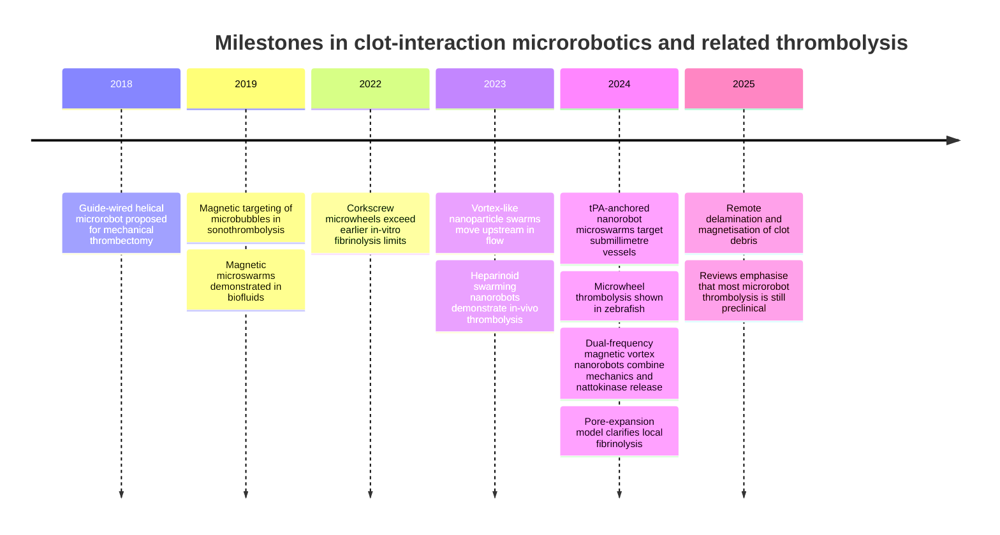
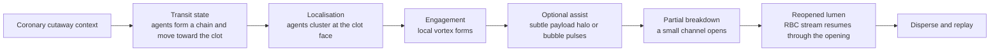

# Swarm-Intelligence Mechanisms for Safe Visualisation in the NanoSwarm Coronary Clot Simulator

## Executive summary

The literature now supports a clear design choice for your simulator: the strongest **science-grounded and demo-readable** mechanism is not a single “magic” clot-clearing effect, but a **sequence of collective behaviours**. The most defensible visual story is: **field-guided localisation of many agents → local reconfiguration into a vortex or corkscrew-like working formation → limited local fibrin loosening or payload release → small channel formation and simulated lumen reopening**. That sequence is directly aligned with the modern microswarm literature on magnetic collective actuation in biofluids, vortex-like upstream nanoparticle swarms, and preclinical thrombolysis studies using swarming magnetic nanorobots, tPA-anchored microswarms, microwheels, and dual-frequency magnetic vortex nanorobots. citeturn12search5turn18search0turn14search7turn15search0turn14search0turn23search0turn13search4

For the clot itself, the most important biological point is that a coronary thrombus is **heterogeneous**. It is not just a red blob. Across cardiovascular disease, thrombi are made of fibrin, red blood cells, platelets, leukocytes, and extracellular traps; in coronary occlusions specifically, composition changes with plaque type and time from symptom onset. Very early arterial thrombi can be platelet-dominant, but aspirated STEMI thrombi are often fibrin-heavy overall, with fibrin increasing and platelet fraction falling over time. RBC incorporation alters fibrin architecture, shifts viscoelastic behaviour, and increases lytic resistance. For visual work, that means the best clot is a **mixed lesion**: fibrin-rich scaffold, darker RBC pockets, and an upstream platelet-rich face rather than a uniform capsule. citeturn4search7turn21search0turn21search1turn21search8turn4search0turn4search2turn26search16

Acoustic or microbubble-assisted thrombolysis is also real and visually compelling, and unlike microrobotic swarms it has some **human adjunctive literature**, especially in ultrasound-enhanced reperfusion. But its mechanism is harder to depict safely because “bubble + ultrasound + clot breakup” can read like a treatment claim rather than a research-inspired educational visual. The safest choice is therefore to make **magnetic swarm localisation + local vortex engagement** the default demo, add **subtle local payload-release cues** as a secondary layer, and keep **bubble-assisted cavitation** as an optional alternate mode or overlay rather than the core story. citeturn16search1turn16search3turn20search5turn20search10turn19search18

Most importantly, nearly all microrobot thrombolysis platforms remain **preclinical**, with major translational hurdles in imaging, closed-loop control, haemocompatibility, operation under physiological flow, retrieval, and scalable manufacturing. Your simulator should therefore present these as **illustrative, literature-inspired interaction modes**, not as clinically proven interventions or outcome predictors. citeturn19search1turn19search2turn19search17turn19search18turn12search0

## Literature landscape

In this field, “swarm intelligence” usually does **not** mean autonomous decision-making by hundreds of fully independent robots. In the papers that matter most for your simulator, it means **externally programmed collective behaviour**: reversible assembly and disassembly, motion as chains/carpets/vortices, wall-hugging upstream transport, and local concentration at a target because magnetic and hydrodynamic interactions are shaped by external fields. That distinction matters because it tells you what to show on screen: not “mini robots thinking”, but **formation changes, coordinated clustering, and local re-tasking**. citeturn12search5turn18search0turn18search2turn14search7

The thrombolysis-specific literature is now dominated by **magnetic micro- and nanorobots**, with **ultrasound/microbubble systems** as the other major branch. Magnetic studies include biocompatible heparinoid-coated swarming nanorobots for synergistic in-vivo thrombolysis, catheter-assisted tPA-anchored magnetic colloidal microswarms for submillimetre arterial recanalisation, targeted tPA/plasminogen microwheels with corkscrew penetration, and dual-frequency magnetic vortex nanorobots that combine mechanical engagement with triggered nattokinase release. Parallel acoustic literature shows magnetically targeted microbubbles, rotating magnetic retention of magnetic microbubbles, and broad sonothrombolysis work where cavitation enhances lysis and drug penetration. Recent reviews agree that these systems are promising but still face translational barriers, and that microrobotic thrombolysis remains mostly preclinical. citeturn15search0turn14search0turn22search1turn23search0turn13search7turn16search1turn16search3turn7search1turn19search2turn19search18

### Key papers most useful for your simulator

| Theme | Key paper | Why it matters for the simulator |
|---|---|---|
| Collective control in biological fluids | *Active generation and magnetic actuation of microrobotic swarms in bio-fluids* citeturn18search0turn18search3 | Establishes that magnetic microswarms can be generated, actuated and navigated in biofluids at all; useful for the **transit-state** visual language. |
| Upstream vortex-like localisation | *Reconfigurable vortex-like paramagnetic nanoparticle swarm enables upstream motions and drug delivery in blood flow* citeturn14search7turn14search23 | Best source for the **vortex/corkscrew swarm shape**, wall-hugging transport, and “arrive then engage” storyboard. |
| In-vivo safe swarm thrombolysis | *Swarming magnetic nanorobots bio-interfaced by heparinoid-polymer brushes for in vivo safe synergistic thrombolysis* citeturn15search0turn15search2 | Strongest direct precedent for **swarm localisation + mechanical contribution + payload-like targeting**. |
| Submillimetre recanalisation | *tPA-anchored nanorobots for in vivo arterial recanalization at submillimeter-scale segments* citeturn14search0turn2search5 | Direct precedent for **localised magnetic microswarms in very small vessels**; useful for restrained “payload assist” visuals. |
| Corkscrew clot penetration | *Breaking the fibrinolytic speed limit with microwheel co-delivery of tissue plasminogen activator and plasminogen* and *Magnetically powered microwheel thrombolysis of occlusive thrombi in zebrafish* citeturn23search0turn23search10turn22search1 | Best precedent for **corkscrew penetration, local channel formation, and mechanical-plus-enzymatic synergy**. |
| Dual-frequency vortex nanorobots | *Dual Frequency-Regulated Magnetic Vortex Nanorobots Empower Nattokinase for Focalized Microvascular Thrombolysis* citeturn13search4turn13search7 | Strongest modern source for **vortex engagement + triggered local release** in one visual mode. |
| Targeted bubble-assisted lysis | *Sonothrombolysis with Magnetically Targeted Microbubbles* and *Sonothrombolysis with magnetic microbubbles under a rotational magnetic field* citeturn16search1turn16search10turn16search0turn16search3 | Best basis for an **optional bubble/cavitation mode**, especially if you want visibly different action at the clot face. |
| Translational overview | *Untethered miniature robots for minimally invasive thrombus treatment*, *Medical Microrobots*, and *Emerging Thrombolysis Technologies in Vascular Thrombosis* citeturn12search0turn19search1turn7search1turn19search18 | Best sources for **what to claim carefully** and what remains preclinical. |

### Research milestones

That timeline shows a genuine progression rather than hype: early work focused on **mechanical access and actuation**, 2019–2023 established **magnetic collective control and targeted microbubble retention**, 2022–2024 added **corkscrew and vortex engagement with local biochemical assistance**, and 2025 reviews still place most microrobotic thrombolysis in the **preclinical** bucket. citeturn8search1turn16search1turn18search0turn23search0turn15search0turn14search0turn22search1turn13search7turn25search16turn17search0turn19search18

## Clot biology for visual modelling

A clot that looks scientifically literate should reflect the fact that thrombi are **composite fibrous materials**. Across cardiovascular disease, the recurrent structural elements are fibrin, RBCs, platelets, leukocytes, and NETs. Coronary thrombi are variable rather than uniform: in STEMI aspirates, many are fibrin-rich overall, but very early thrombi can be mostly platelet-rich, and fibrin fraction rises with increasing ischaemic time while platelet fraction falls. Plaque rupture versus plaque erosion also changes the fibrin/platelet balance. citeturn4search7turn21search8turn21search0turn21search1turn21search12

Mechanically, fibrin is the load-bearing scaffold. Its network architecture changes under flow, and fibrin exhibits unusual elasticity and strain-stiffening. Platelet-rich arterial clots can be markedly stronger and stiffer under high shear, while RBC incorporation increases heterogeneity and contributes to viscoelasticity; RBC-containing fibrin is also more resistant to lysis because RBCs alter fibrin structure and impair plasminogen activation. Recent work on internal fibrinolysis further suggests that lysis often advances by **pore expansion and local channel opening**, which is exactly the right scientific cue for your animation language. citeturn25search0turn25search5turn26search16turn4search0turn4search2turn26search8turn25search16

For a coronary educational cutaway, the best compromise is therefore **not** a pure venous-style red thrombus and **not** a pure white platelet plug. The most defensible stylisation is a **mixed arterial occlusion**: a fibrin-rich main body, darker embedded RBC pockets, and a denser platelet-rich upstream face. That lets you show why a coordinated swarm would first interact at the **surface layer**, then begin to open a **local channel** into the clot interior rather than making the entire obstruction vanish at once. This is an inference from the composition and mechanics studies above, not a patient-specific claim. citeturn21search0turn21search1turn21search8turn4search2turn25search16

### Biology-to-visual translation

| Biological point | What to show |
|---|---|
| Coronary thrombi are mixed and time-dependent, not uniform. citeturn21search0turn21search1turn21search8 | A **layered clot** with a denser upstream face and more fibrous core, not a smooth pill. |
| Fibrin is the structural scaffold. citeturn25search5turn4search7 | Pale fibrin strand cues over a darker red/maroon core. |
| RBCs alter viscoelasticity and increase lytic resistance. citeturn4search0turn4search2turn26search8 | Embedded RBC pockets that **clear slowly**, not instant disappearance. |
| Flow and fibrinolysis reshape the network locally. citeturn25search0turn25search16 | Animate **local pore expansion and channeling**, not uniform melting of the whole clot. |

## Mechanism comparison

I use a simple evidence ladder here: **theory/review < in vitro < ex vivo < small-animal in vivo < large-animal in vivo < human adjunctive data**.

| Mechanism | Evidence level | Visual complexity | Demo-readability | Safety/claim risk | Implementation effort |
|---|---|---:|---:|---:|---:|
| **Magnetic-field aggregation and localisation** citeturn18search0turn15search0turn14search0 | Strong preclinical; in vitro to small-animal in vivo | Low–medium | High | Low | Low–medium |
| **Vortex/corkscrew engagement at the clot face** citeturn14search7turn23search0turn13search4 | Strong preclinical; in vitro and small-animal in vivo | Medium | Very high | Low–medium | Medium |
| **Local enzymatic or drug-assisted loosening** (tPA, plasminogen, nattokinase, generic payloads) citeturn14search0turn23search0turn13search7turn24search4 | Strong preclinical; broad nanocarrier review base | Medium | High | Medium | Medium |
| **Acoustic/microbubble-assisted interaction** citeturn16search1turn16search3turn20search5 | Extensive bench and animal literature; some human adjunctive data in sonothrombolysis broadly | Medium–high | Very high | Medium–high | Medium |
| **Cavitation-driven fragmentation** citeturn20search13turn6search9turn20search10 | Strong as a sonothrombolysis mechanism; mixed translational outcomes | Medium–high | High | High if overclaimed | Medium |
| **Mechanical abrasion or boring** with helical/screw-like microrobots citeturn8search1turn8search20 | Bench and ex vivo; device-like rather than true swarm | Medium | Medium | High | Medium–high |
| **Shear-enhancement and local mixing** around rotating formations citeturn14search23turn16search3turn25search0 | Mechanistically plausible and partially demonstrated; causal attribution often indirect | Low | High if shown as flow overlay | Low | Low |
| **Remote delamination and debris magnetisation** citeturn17search0turn17search3 | Newer 2025 work; high promise, more device/procedure-flavoured | High | Medium | High | High |

The mechanism table yields a practical conclusion. The best **core** visual mechanisms are the three that most clearly express “swarm behaviour” while remaining preclinical and non-therapeutic in tone: **aggregation/localisation**, **vortex or corkscrew engagement**, and **local payload-assisted fibrin loosening**. Acoustic microbubble modes are real and eye-catching, but they visually read as a treatment platform more readily than the magnetic swarm literature does. Helical boring and debris retrieval are interesting, but they shift the story toward **catheter thrombectomy**, which weakens the swarm identity of your simulator. citeturn15search0turn14search0turn23search0turn13search7turn16search1turn20search10turn17search0

A second important conclusion is about **plausibility boundaries**. Magnetic swarm localisation and reconfiguration are well supported, but routine navigation in real arterial flow is still difficult; ex-vivo porcine aorta work shows swimming speed drops as flow rises, even for haemocompatible untethered robots. That means your visual should show decisive action **near the clot zone**, but avoid overpromising long-distance free navigation through a beating coronary tree. citeturn19search17turn19search18

## Visual motifs and Three.js implementation

The safest implementation strategy is to **visualise mechanisms as local interaction cues**, not as literal patient treatment physics. For Three.js, that means instancing, masks, and deterministic state changes rather than heavy real-time clot mechanics or computational fluid dynamics.

| Visual motif | Scientific cue | Three.js implementation note | Low-risk approximation |
|---|---|---|---|
| **Transit-to-localise formation change** | Magnetic swarms can reversibly assemble, move, and reconfigure in biofluids; vortex-like nanoparticle swarms can move upstream and anchor near targets. citeturn18search0turn14search7turn14search23 | Use a single `InstancedMesh` of tiny capsule or chevron agents; drive them by a deterministic formation state machine: line/chain → clustered arc → vortex ring. | No per-agent autonomy; simply interpolate to authored formations keyed by sim phase. |
| **Local vortex erosion front** | Corkscrew/vortex motion is one of the clearest physically grounded ways agents interact with clots. citeturn23search0turn23search10turn13search4 | Put agents on one or two helical splines around the clot face; use per-instance phase offsets so the cluster reads as a collective rotating tool rather than random dots. | Drive only a small clot-contact zone; leave the rest of the clot visually stable. |
| **Fibrin strand peeling / loosening** | Clot breakdown is better represented as local pore expansion and fibrin network disruption than whole-clot disappearance. citeturn25search16turn4search2 | Add short `LineSegments` or thin `TubeGeometry` strands embedded at the clot surface; fade, shorten, and detach them near the contact zone. | Only animate strands in a narrow band near the swarm; use a secondary “opened-channel” clot mesh instead of full mesh deformation. |
| **Payload-release halo** | Local biochemical assistance is common in targeted thrombolysis, including tPA and nattokinase systems. citeturn14search0turn13search7turn24search4 | Use a soft radial gradient shell or sprite-cloud around the swarm–clot interface; pulse opacity gently, not explosively. | Keep it labelled as **payload cue** or **local fibrin-loosening zone**, not a quantified drug field. |
| **RBC bypass and re-entry stream** | Coronary thrombi contain trapped RBCs, and local channel opening is a more defensible visual than instant full recanalisation. citeturn21search8turn4search2turn25search16 | Sparse RBC `InstancedMesh` elements can follow splines around the clot, then through the reopened microchannel once it appears. | Keep RBC count low and stylised; use them as flow markers, not haemodynamics. |
| **Bubble-assisted cavitation pulses** | Microbubble-enhanced sonothrombolysis relies mainly on cavitation, with stable/inertial oscillation regimes depending on parameters. citeturn16search1turn20search13turn6search9 | Use translucent sprite spheres that rapidly expand and fade at the clot edge; add a brief refractive ripple or local screen-space distortion. | Keep pulses sparse and local; avoid violent blast language or tissue-damage visuals. |
| **Flow-line reconfiguration overlay** | Rotating swarms and clot geometry alter local flow paths; flow also affects fibrin structure. citeturn14search23turn16search3turn25search0 | Add optional streamlines as animated curves with small moving dashes; before opening they bend sharply around the clot, after opening a few lines pass centrally. | Use this only as an overlay toggle; do not label it as computed perfusion. |
| **Semi-cutaway lumen close-up** | Educational clarity is highest when vessel wall, lumen, clot and agents are all visually distinguishable. citeturn16search1turn21search8 | Use a clipping plane or wedge cutaway, Fresnel rim on the vessel wall, and a darker interior lumen. | Keep anatomy stylised, not surgical; the goal is explanatory readability. |

Two implementation choices deserve emphasis. First, **do not use per-frame constructive solid geometry** to “subtract” the clot; it is expensive and unnecessary. A cheaper and safer approach is to blend between a baseline clot mesh and one or two authored secondary states: *untouched*, *partially channelled*, *more open*. Secondly, **do not simulate quantitative haemodynamics**. Make every metric and animation clearly illustrative—state-driven, deterministic, and replayable—rather than pretending to solve actual transport, cavitation, or fibrinolysis equations.

## Demo recommendation, safe copy, and telemetry

The best demo should show **three mechanisms**, but not as three disconnected fantasies. They should be ranked and staged by how well they combine clarity, literature support, and low claim risk.

### Recommended mechanisms to depict

| Rank | Mechanism | Why it should be in the demo |
|---|---|---|
| **Top choice** | **Field-guided aggregation with local vortex engagement** | This is the clearest expression of “swarm intelligence” in the clot literature and the easiest for judges to understand instantly. It directly reflects upstream localisation, collective reconfiguration, and local work-mode switching. citeturn14search7turn15search0turn23search0 |
| **Second choice** | **Local payload-assisted fibrin loosening** | This adds biochemical plausibility without changing the main story. It is strongly grounded in tPA-anchored and nattokinase-loaded systems, but can be shown safely as a subtle localised halo rather than a strong clinical drug claim. citeturn14search0turn13search7turn24search4 |
| **Third choice** | **Optional bubble-assisted acoustic agitation** | It has strong sonothrombolysis literature and excellent visual impact, but higher claim sensitivity. It works best as an alternate concept overlay or bonus mode, not the default demonstration story. citeturn16search1turn16search3turn20search5turn20search10 |

### Recommended demo sequence

That sequence is the safest because it translates the literature into a non-clinical explainer. It foregrounds **collective behaviour**, keeps the action **local**, and ends with a **simulated channel opening** rather than a miracle cure. citeturn18search0turn14search7turn15search0turn25search16turn19search18

### Storyboard captions

| Mechanism | Before | Active interaction | Partial breakdown | Reopened lumen |
|---|---|---|---|---|
| **Field-guided vortex mode** | **Illustrative clot narrows the lumen** | **Agents cluster and rotate at the clot face** | **A small simulated channel begins to open** | **The simulated flow path widens** |
| **Payload-assist mode** | **A fibrin-rich core limits passage** | **Localised payload release starts at the surface** | **Fibrin strands loosen near the contact zone** | **The channel grows through the clot** |
| **Bubble-assist mode** | **Flow is restricted at the clot edge** | **Bubble pulses focus agitation at the boundary** | **Surface fragments give way locally** | **A wider illustrative lumen is visible** |

### Safe UI copy

| Prefer | Avoid |
|---|---|
| **Illustrative clot model** | Patient clot |
| **Field-guided micro-agent coordination** | Robot treatment |
| **Local fibrin loosening** | Dissolves the clot |
| **Simulated channel opening** | Restores blood flow |
| **Payload-release cue** | Proven drug delivery |
| **Bubble-assisted agitation** | Ultrasound cure |
| **Research-inspired interaction mode** | Clinically proven solution |
| **Replayable educational visualisation** | Predicted outcome |

### Visual-only telemetry hooks

| Hook | What it communicates | Safe pre-demo or post-submission | Notes |
|---|---|---|---|
| **Local concentration heatmap** | Where the swarm is clustering | **Safe pre-demo** | Render as a soft 2D/3D glow around the clot face; this is the cleanest proxy for localisation. |
| **Agent state badge** | Transit / localise / engage / disperse | **Safe pre-demo** | Very cheap to add and easy for judges to follow. |
| **Erosion progress meter** | Relative local breakdown at the contact zone | **Safe pre-demo** | Label as **illustrative** rather than quantitative. |
| **Open-channel index** | Relative size of the visible lumen opening | **Safe pre-demo** | Best tied to the cutaway view, not a clinical metric. |
| **Vortex intensity indicator** | Strength of the working formation | **Post-submission** | Safe conceptually, but easiest to misread as a real physical parameter if rushed. |
| **Payload-zone overlay** | Where the local release cue is active | **Post-submission** | Useful, but needs careful wording to avoid dosage implications. |
| **Cavitation pulse counter** | Frequency of bubble events | **Post-submission** | Too easy to mistake for a validated acoustic output. |
| **Flow-diversion overlay** | How streamlines reroute around the clot | **Post-submission** | Useful if you later add a cleaner flow visual layer. |

The best pre-demo telemetry is therefore **concentration**, **state**, **erosion progress**, and **open-channel index**. These are visually intuitive, cheap to build, and narratively aligned with the literature without implying validated treatment metrics.

The executive recommendation is straightforward. Make the **default simulator story** a **magnetic swarm sequence**: agents approach in a transit formation, localise at the clot face, reconfigure into a small vortex or corkscrew-like cluster, and then open a **local simulated channel** while a restrained payload halo suggests fibrin loosening. Keep **microbubble/cavitation** as an optional alternate overlay for visual variety. Do **not** centre the demo on helical boring, catheter-like drilling, or debris retrieval, because those cues pull the simulator away from swarm intelligence and toward interventional device claims. This recommendation best matches the strongest preclinical literature, the clot-biology evidence for local pore expansion, and the need for a polished but non-clinical educational explainer. citeturn15search0turn14search0turn23search0turn13search7turn16search1turn25search16turn19search18